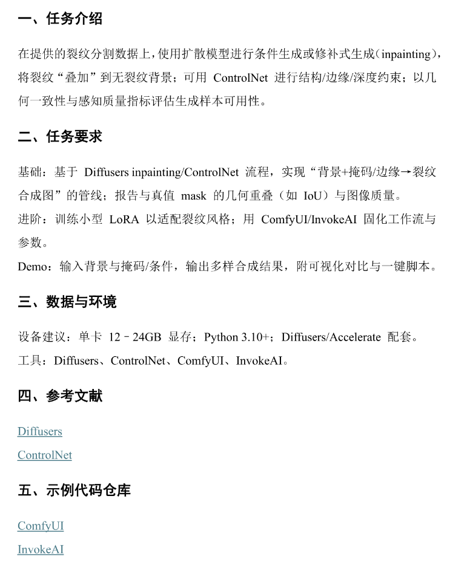
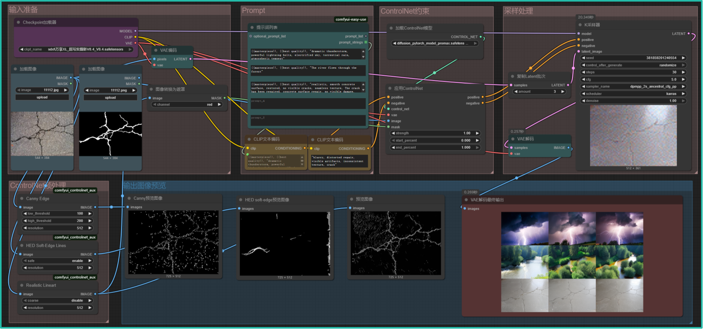
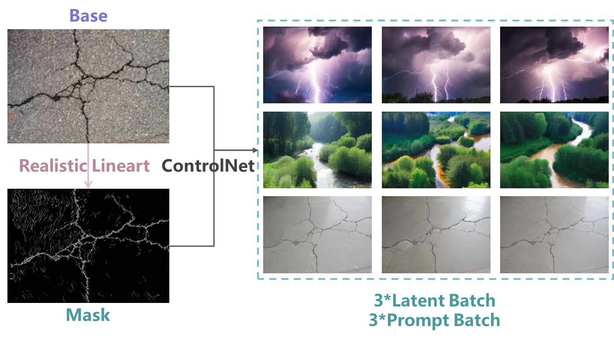
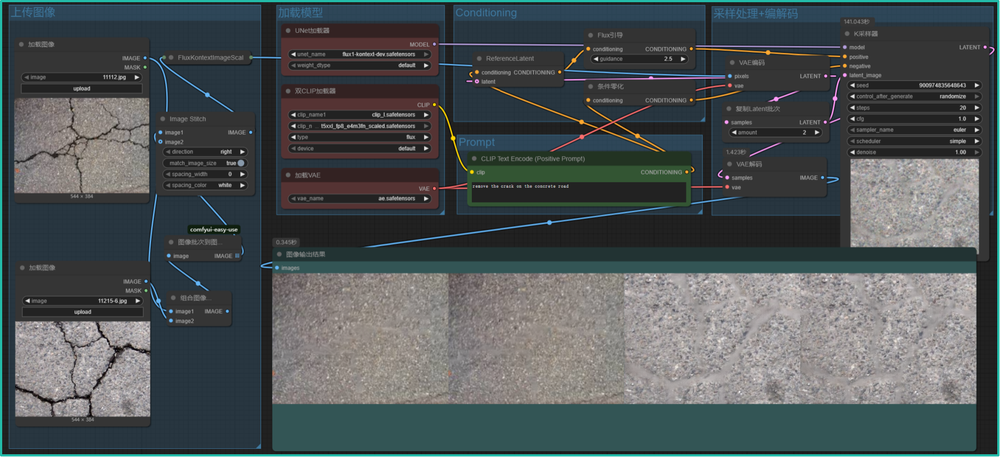
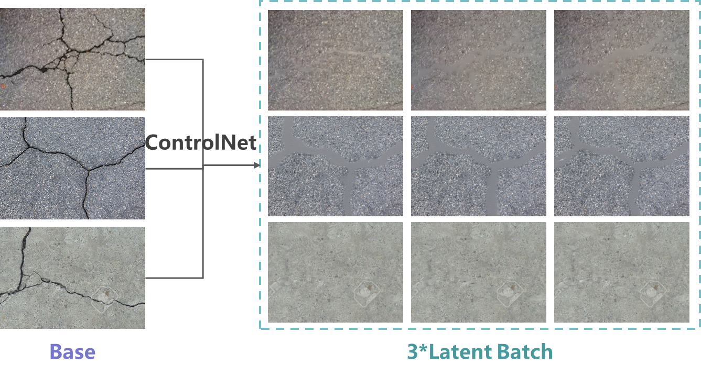
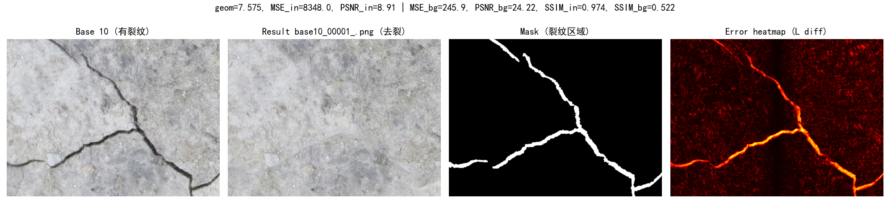
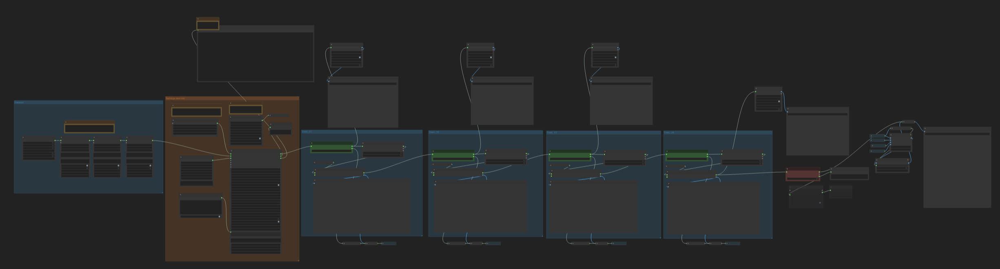
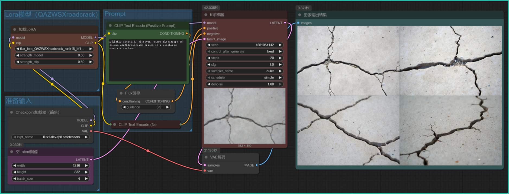
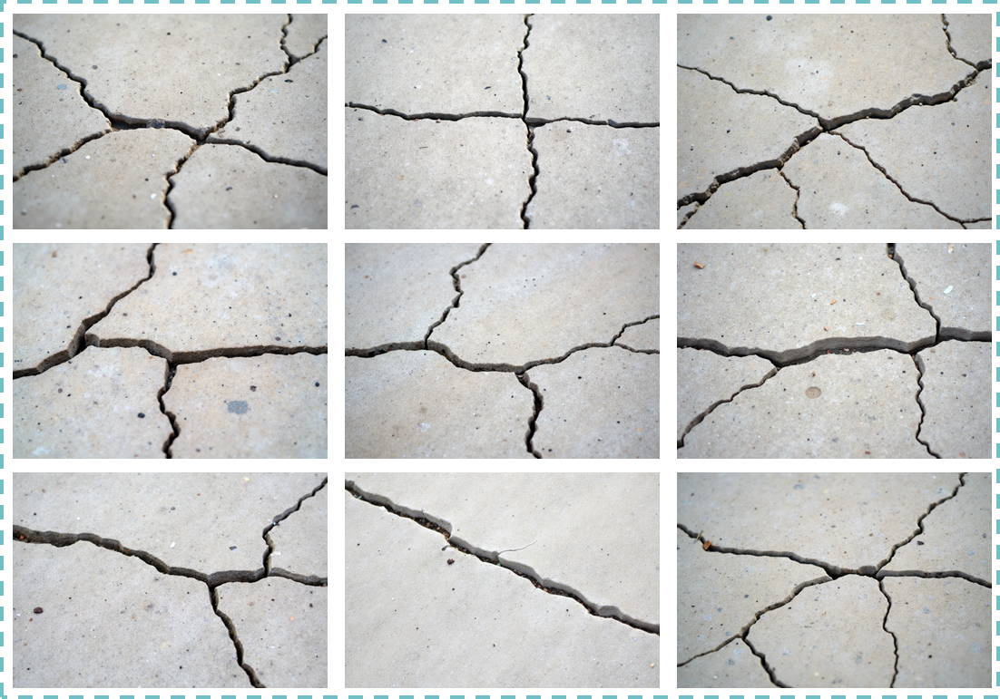
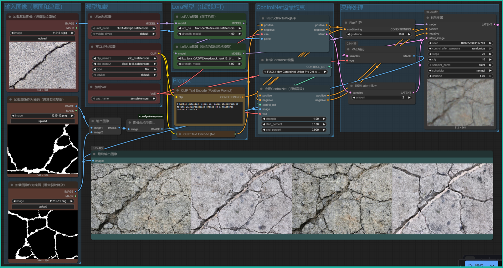

# 🚀Lora-ControlNet-for-crack-repair-and-generation-on-DeepCrack-dataset-ComfyUI
Crack repair and generation work based on SDXL and FLUX.1, implemented on ComfyUI with different workflows, for the Artificial Intelligence and Applications course assignment for the Fall 2025 semester as group-21.
# ⭕任务背景
本项目任务来源于北京航空航天大学2025秋人工智能原理与应用课程，其中本组（21组）选择计算机视觉分支下图像生成任务，任务背景    
基于任务背景，小组设定以下四个不同任务：  
1. 根据裂纹形状约束，通过不同prompt下图像生成进行风格迁移；
2. 搭建工作流进行裂纹去除，并通过评价指标观察裂纹去除和背景一致性效果；
3. 训练小型路面裂纹风格Lora模型，方便进行裂纹生成；
4. 基于第三步得到的lora模型，进行基础裂纹+复杂遮罩的裂纹合成工作流。
# ⭕技术支撑
由于小组成员此前未进行过相关内容工作，因此本项目主要基于ComfyUI工作流为主+Python脚本为辅的方式，相关软硬件配置如下：
## 硬件配置
显卡（GPU）: NVIDIA GeForce RTX 4090;  
显存（VRAM）: 24,564 MB;  
CPU: 12th Gen Intel(R) Core(TM) i9-12900KF (12核)；  
操作系统: Windows 10
## 软件配置
ComfyUI 版本: 0.3.67  
ComfyUI 前端版本: 1.28.8  
Python 版本: 3.11.9  
PyTorch 版本: 2.7.0+cu128  
Xformers 版本: 0.0.30+4cf69f09.d20250606  
CUDA 版本: 128 (与 GPU 驱动兼容)
## 其他工具和配置
ComfyUI-Manager 版本: 3.32.5  
FFMPEG: 已启用 OpenCV 和 FFMPEG 支持
## 依赖项
其中conda环境可通过 进行添加
# ⭕项目介绍
下面对不同项目进行简要介绍：
## 1️⃣基于SDXL+ControlNet的遮罩约束写实风格迁移
本任务基于SDXL和ControlNet模型搭建工作流进行不同prompt下遮罩约束的写实风格迁移，具体工作流如图：    
通过ComfyScript进行工作流的翻译后，使用 进行跑图，示例结果如图：  
## 2️⃣基于FLUX.1 Kontext的裂纹去除
本任务基于FLUX.1 Kontext模型搭建工作流进行给定裂纹图片的裂纹去除工作，具体工作流如图：    
通过ComfyScript进行工作流的翻译后，使用 进行跑图，示例结果如图：    
同时还通过 对裂纹去除结果进行了评估和可视化，部分示例结果如图：    
## 3️⃣基于FLUX trainer的路面裂纹风格lora训练
本任务首先通过FLUX trainer在ComfyUI中以工作流的形式对给定数据集进行训练，得到了一个与数据集风格一致的路面裂纹Lora模型，基本工作流框架如图：    
之后将lora模型串联到基本模型中进行裂纹生成，基本工作流框架如图：    
使用 进行跑图，示例结果如图：  
## 4️⃣基于FLUX.1 Kontext+ControlNet的裂纹生成
本任务在上一步基础上将lora模型串联到controlnet工作流中对裂纹简单的base图片进行遮罩合成，通过裂纹复杂的遮罩叠加，生成裂纹合成图片，基本工作流框架如图：   
通过ComfyScript进行工作流的翻译后，使用 进行跑图，示例结果如图：  
